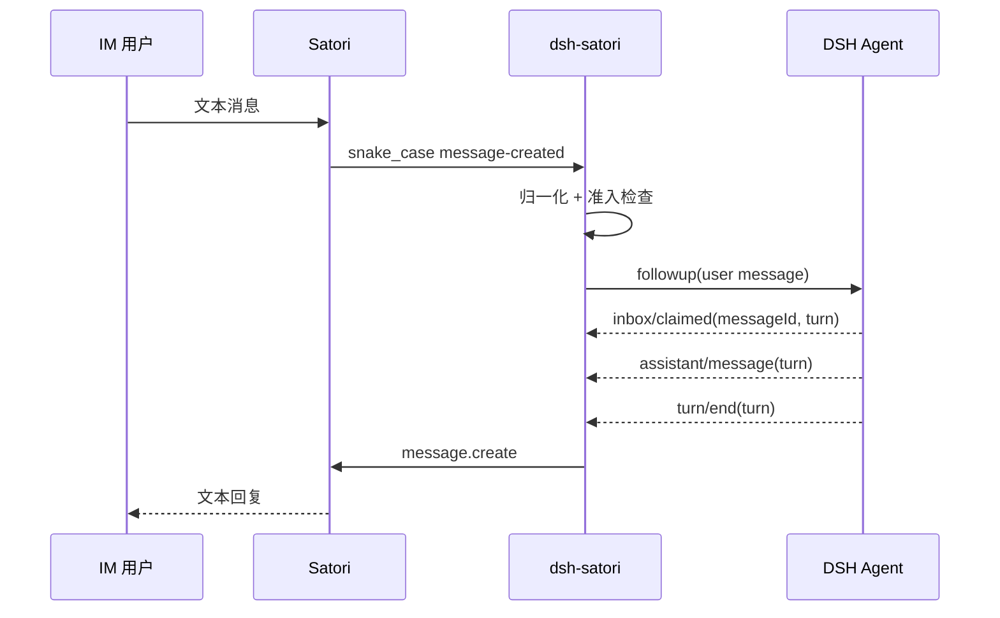

# dsh-satori

[中文](README-zh.md) | [English](README.md)

`dsh-satori` 是一个连接 DeepSeek Harness 与 Satori 的轻量插件。Satori 负责接入 Telegram、Discord、飞书等 IM 平台，插件负责把经过准入检查的消息映射到 DSH session，并把对应 turn 的最终回复发回原会话。

当前 MVP 只处理文本消息。它直接使用 Satori 的 `/v1/events` WebSocket 与 `/v1/message.create` API，不在插件里重复实现各个平台协议。

## 架构


更完整的设计图见 [`docs/architecture.md`](docs/architecture.md)、[`docs/data-flow.md`](docs/data-flow.md) 和 [`docs/uml.md`](docs/uml.md)。这些 Mermaid 图需要随代码一起更新。

## 环境要求

- DeepSeek Harness，已配置 agent loop 与 session persistence。
- Node.js 22.19 或更高版本，与当前 DSH 运行时要求一致。
- 一个正在运行的 Satori Server，并至少配置一个 IM adapter。

默认 Satori 地址：

```text
http://127.0.0.1:5140/satori
```

## 构建

```sh
git clone https://github.com/Ri0n72Y/dsh-satori.git
cd dsh-satori
pnpm install
pnpm test
pnpm build
```

构建结果位于 `lib/`。

## 安装到 DSH

### 从本地目录安装

```sh
dsh plugin --profile web add /absolute/path/to/dsh-satori
```

### 从 GitHub 安装

```sh
dsh plugin --profile web add github:Ri0n72Y/dsh-satori
```

Git 安装会通过 `prepare` 编译 TypeScript。pnpm 如果阻止构建脚本，在 `$DSH_HOME/profiles/web/pnpm-workspace.yaml` 中加入：

```yaml
allowBuilds:
  dsh-satori: true
```

需要固定版本时可以安装具体 commit：

```sh
dsh plugin --profile web add github:Ri0n72Y/dsh-satori#<commit-sha>
```

安装后检查最终配置并启动 DSH：

```sh
dsh --profile web --dump-config
dsh --profile web
```

## 配置 Satori

基础连接：

```sh
SATORI_BASE_URL=http://127.0.0.1:5140/satori
SATORI_TOKEN=your-token
```

如果 Satori Server 不要求认证，可以不设置 `SATORI_TOKEN`。

### 准入控制

插件默认不接受任何外部发送者。至少配置允许的用户或频道：

```sh
SATORI_ALLOWED_USERS=telegram:123456
```

或者：

```sh
SATORI_ALLOWED_CHANNELS=discord:987654321
```

多个值使用逗号分隔：

```sh
SATORI_ALLOWED_USERS=telegram:123456,lark:ou_xxx
```

还可以限制允许驱动 DSH 的 Satori 登录身份：

```sh
SATORI_ALLOWED_LOGINS=telegram:my_bot_id
```

这些值使用 `<platform>:<id>`。平台名和 ID 在内部会分别进行 URI 编码。

仅在可信测试环境中，可以临时关闭准入限制：

```sh
SATORI_UNSAFE_ALLOW_ALL=1
```

机器人自身消息和 Satori 标记为 bot 的发送者仍会被忽略。

也可以直接在 profile 中配置插件：

```yaml
- id: satori
  name: dsh-satori
  config:
    baseUrl: http://127.0.0.1:5140/satori
    token: your-token
    allowedUsers:
      - telegram:123456
    allowedChannels: []
    allowedLogins: []
    sessionPrefix: satori
    maxLiveAgents: 32
    idleTtlMs: 900000
```

`provider` 和 `model` 是可选项。不填写时，插件使用 DSH 当前组合提供的模型路由。

## Session 映射

当前 MVP 为每个发送者在每个频道建立独立 session：

```text
<sessionPrefix>:<platform>:<selfId>:<channelId>:<userId>
```

这样群聊中的不同用户不会共享 DSH 历史。收到消息后，插件先查找在线 Agent；如果没有，则检查 session persistence，存在时 resume，不存在时 create。

插件默认最多持有 32 个自己创建的 live Agent。达到上限时优先释放空闲最久的 Agent；超过 `idleTtlMs` 的空闲 Agent 会在容量检查时回收。持久化 session 后续仍可恢复。

## 消息路径



插件只会发送与该 Satori 输入精确关联的 DSH turn。其他入口驱动同一 session 产生的回复不会被转发到 IM。

## 协议兼容

插件针对 Satori v1 HTTP/WebSocket 接口工作。当前 Satori Server 在 wire 上发送 snake_case 字段，插件会在 `SatoriClient` 边界统一转为 camelCase 后再进入业务逻辑。

## 开发

修改前先阅读 [`AGENTS.md`](AGENTS.md)。如果代码改变组件关系、依赖、消息流、session identity、生命周期、认证、准入、重试或 ownership，需要在同一个 PR 中更新对应 Mermaid 图。

```sh
pnpm test
pnpm build
```

## License

MIT
