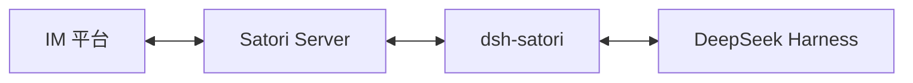
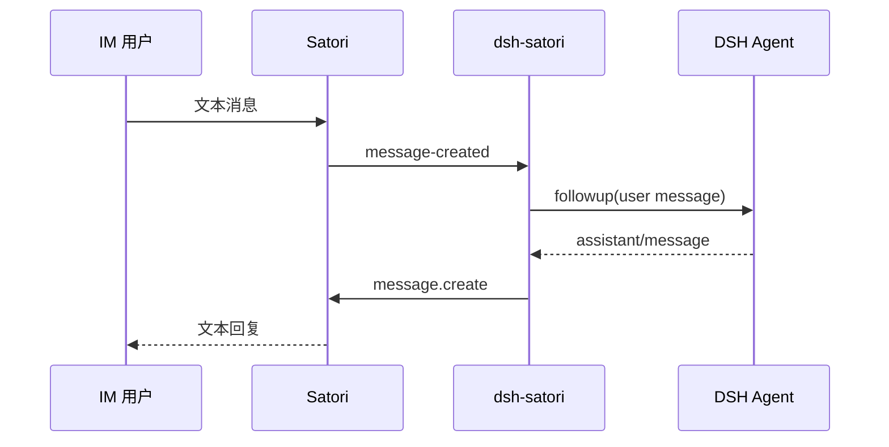

# dsh-satori

[中文](README-zh.md) | [English](README.md)

`dsh-satori` 是一个连接 DeepSeek Harness 与 Satori 的轻量插件。Satori 负责接入 Telegram、Discord、飞书等 IM 平台，插件负责把 Satori 会话映射到 DSH session，并把 DSH 的回复发回原会话。

当前 MVP 只处理文本消息。相同的 Satori 登录身份与频道会映射到稳定的 DSH session，因此插件重连后可以继续原来的会话。

## 架构



更完整的设计图见 [`docs/architecture.md`](docs/architecture.md)、[`docs/data-flow.md`](docs/data-flow.md) 和 [`docs/uml.md`](docs/uml.md)。这些 Mermaid 图需要随代码一起更新。

## 环境要求

- DeepSeek Harness，已配置 agent loop 与 session persistence。
- Node.js 22.19 或更高版本，与当前 DSH 运行时要求一致。
- 一个正在运行的 Satori Server，并至少配置一个 IM adapter。

默认 Satori 地址：

```text
http://127.0.0.1:5140/satori
```

## 构建

```sh
git clone https://github.com/Ri0n72Y/dsh-satori.git
cd dsh-satori
pnpm install
pnpm test
pnpm build
```

构建结果位于 `lib/`。

## 安装到 DSH

### 从本地目录安装

```sh
dsh plugin --profile web add /absolute/path/to/dsh-satori
```

安装后先检查最终配置，再启动 DSH：

```sh
dsh --profile web --dump-config
dsh --profile web
```

### 从 GitHub 安装

```sh
dsh plugin --profile web add github:Ri0n72Y/dsh-satori
```

Git 安装会通过 `prepare` 编译 TypeScript。pnpm 在执行依赖构建脚本前可能要求显式授权。如果第一次安装被阻止，在 `$DSH_HOME/profiles/web/pnpm-workspace.yaml` 中加入：

```yaml
allowBuilds:
  dsh-satori: true
```

然后重新执行安装命令。

需要固定版本时，可以直接固定 commit：

```sh
dsh plugin --profile web add github:Ri0n72Y/dsh-satori#<commit-sha>
```

## 配置 Satori

插件自带的 Cordis patch 会读取以下环境变量：

```sh
SATORI_BASE_URL=http://127.0.0.1:5140/satori
SATORI_TOKEN=your-token
```

如果 Satori Server 不要求认证，可以不设置 `SATORI_TOKEN`。

也可以直接修改 profile 中的 `cordis.patch.yml`：

```yaml
- id: satori
  name: dsh-satori
  config:
    baseUrl: http://127.0.0.1:5140/satori
    token: your-token
    sessionPrefix: satori
```

`provider` 和 `model` 是可选项。不填写时，插件使用 DSH 当前组合提供的模型路由。

## Session 映射

Satori 会话会映射为：

```text
<sessionPrefix>:<platform>:<selfId>:<channelId>
```

收到消息后，插件会先查找同 ID 的在线 Agent；没有则尝试恢复持久化 session；仍无法恢复时再创建新的 session。

## 当前消息路径



## 开发

修改前先阅读 [`AGENTS.md`](AGENTS.md)。如果代码改变组件关系、依赖、消息流、session identity、生命周期、认证、重试或 ownership，需要在同一个 PR 中更新对应 Mermaid 图。

```sh
pnpm test
pnpm build
```

## License

MIT
