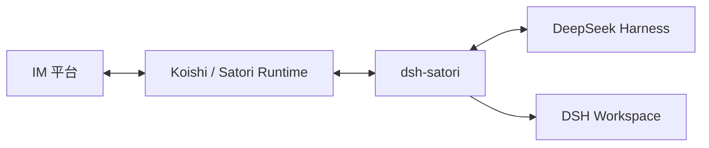

# dsh-satori

[中文](README-zh.md) | [English](README.md)

`dsh-satori` 是 DeepSeek Harness 与 Satori 之间的轻量桥接插件。它接收 Satori 消息，执行准入检查和 session 映射，把文本交给 DSH Agent，再将最终回复发回原频道。

当前 MVP 只处理文本。

## 架构



平台账号、Token、App ID、Secret 等凭据配置在 Koishi / Satori Runtime，不在 DSH 或 `dsh-satori` 中配置。请先准备一个已经配置好平台 adapter 和 Satori Server 的运行环境。

- [Koishi 安装文档](https://koishi.chat/zh-CN/manual/starter/)
- [Satori SDK 与适配器文档](https://satori.chat/zh-CN/sdk/)
- [`server-satori` 配置](https://koishi.chat/zh-CN/plugins/develop/server-satori)

详细设计见 [`docs/architecture.md`](docs/architecture.md)、[`docs/data-flow.md`](docs/data-flow.md) 和 [`docs/uml.md`](docs/uml.md)。

## 环境要求

- DeepSeek Harness，已配置 agent loop 与 session persistence。
- Node.js `^22.19.0 || >=24.0.0`。
- 已配置的 Koishi / Satori Runtime，并至少有一个可用 IM adapter。

DSH 源码兼容检查固定在 `47f943859bef60e4160492346772ded9b24f765a`，仓库版本为 `0.1.0-rc.5`。插件依赖的已发布 DSH peer 从 `0.1.0-rc.6` 起。

## 安装到 DSH

GitHub：

```sh
dsh plugin --profile web add github:Ri0n72Y/dsh-satori
```

本地目录：

```sh
dsh plugin --profile web add /absolute/path/to/dsh-satori
```

Git 安装会通过 `prepare` 编译 TypeScript。如果 pnpm 阻止构建脚本，在 `$DSH_HOME/profiles/web/pnpm-workspace.yaml` 中加入：

```yaml
allowBuilds:
  dsh-satori: true
```

安装后检查配置并启动：

```sh
dsh --profile web --dump-config
dsh --profile web
```

## 配置

```sh
SATORI_BASE_URL=http://127.0.0.1:5140/satori
SATORI_TOKEN=your-token
SATORI_CWD=/absolute/path/to/safe-workspace
SATORI_ALLOWED_USERS=telegram:123456
SATORI_ALLOWED_CHANNELS=discord:987654321
SATORI_ALLOWED_LOGINS=telegram:my_bot_id
```

`SATORI_TOKEN` 和 `SATORI_CWD` 可以省略。

Web profile 会在 `Settings > Plugins > Configurable` 中显示 `dsh-satori` 配置卡。`Workspace directory` 控制 Satori session 的工作目录，并覆盖 `SATORI_CWD`。如果该目录已经是 DSH Workspace，插件直接复用；否则把这个已存在的目录注册为新 Workspace。清空该项则不绑定工作区。

切换 Workspace 会为同一个 Satori 发送者派生新的 SessionId，避免在不同项目之间恢复同一段 DSH 会话历史。Workspace 路径使用 DSH 的 canonical path，并在 session 创建后通过 `attachSession()` 加入该 Workspace 的会话列表。

插件默认拒绝外部发送者。至少配置 `SATORI_ALLOWED_USERS` 或 `SATORI_ALLOWED_CHANNELS`。多个值使用逗号分隔，ID 可以包含 `:`。仅在可信测试环境中使用：

```sh
SATORI_UNSAFE_ALLOW_ALL=1
```

## 行为

- 入站 `message.content` 使用官方 `@satorijs/element` 解析，只把 text 节点送入模型；图片、mention、quote 等元素暂不进入模型上下文。
- 出站文本通过同一个 element 库安全序列化，模型输出的 `<at/>`、`` 等内容不会被当成 Satori 指令。
- 群聊按发送者隔离 DSH session，并使用源 `message.id` 生成标准 Satori quote；私聊不加 quote。
- 只有与原始 Satori 输入精确关联的 `completed` 或 `max-tokens` turn 才会发送回复。最后一次 committed assistant message 没有可见文本时，不复用更早的文本。
- `sn` 是接收游标。当前 inbound 和 outbound 按 at-most-once 语义处理；真正的 replay 能力取决于所部署的 Satori Server。

SessionId 由 Satori 身份字段和当前 Workspace 路径计算 SHA-256 派生键，不把完整外部 ID 或目录写入持久化目录名。插件默认最多持有 32 个自己创建的 live Agent，只回收 idle Agent。

## 开发与验证

```sh
pnpm install --frozen-lockfile
pnpm test
pnpm build
pnpm pack
```

当前验证结果：

- Vitest 47/47 通过，共 8 个测试文件。
- Host ESM 与 Web client bundle 均构建并打包通过。
- pinned DSH `0.1.0-rc.5` 源码声明 strict typecheck 通过，包括 Workspace、Settings 和 WebServer API。
- Satori 线协议运行时测试 13/13 通过；该测试早于 Workspace 面板功能，DSH 侧使用桩。
- 真实 DSH Web 配置卡、WorkspaceRegistry、Agent Loop、模型与真实 Satori Server 的完整 E2E 仍需验证。

开发约束见 [`AGENTS.md`](AGENTS.md)。

## License

MIT
