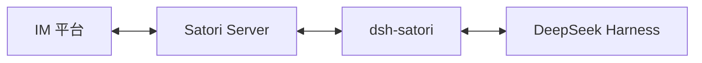
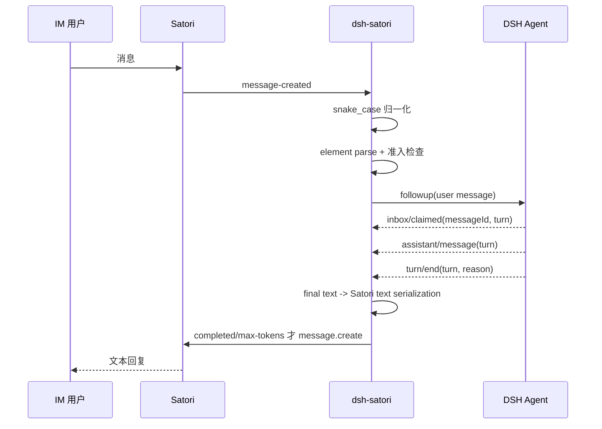

# dsh-satori

[中文](README-zh.md) | [English](README.md)

`dsh-satori` 是连接 DeepSeek Harness 与 Satori 的轻量插件。Satori 负责 Telegram、Discord、飞书等 IM 平台，插件负责准入检查、DSH session 映射和回复关联。

当前 MVP 只处理文本。它直接使用 Satori `/v1/events` WebSocket 与 `/v1/message.create` API。

## 架构



详细设计见 [`docs/architecture.md`](docs/architecture.md)、[`docs/data-flow.md`](docs/data-flow.md) 和 [`docs/uml.md`](docs/uml.md)。

## 环境要求

- DeepSeek Harness，已配置 agent loop 与 session persistence。
- Node.js 22.19 或更高版本。
- 一个正在运行的 Satori Server，并至少配置一个 IM adapter。

当前 CI 的 DSH API 兼容基线固定为 DeepSeek Harness `47f943859bef60e4160492346772ded9b24f765a`（仓库版本 `0.1.0-rc.5`）。兼容 job 会使用 DSH 自己的 `build:lib:host` 构建公开声明，再对本插件执行严格 TypeScript 检查。

## 构建

```sh
git clone https://github.com/Ri0n72Y/dsh-satori.git
cd dsh-satori
pnpm install --frozen-lockfile
pnpm test
pnpm build
```

构建结果位于 `lib/`。

## 安装到 DSH

本地目录：

```sh
dsh plugin --profile web add /absolute/path/to/dsh-satori
```

GitHub：

```sh
dsh plugin --profile web add github:Ri0n72Y/dsh-satori
```

Git 安装会通过 `prepare` 编译 TypeScript。如果 pnpm 阻止构建脚本，在 `$DSH_HOME/profiles/web/pnpm-workspace.yaml` 中加入：

```yaml
allowBuilds:
  dsh-satori: true
```

安装后检查配置并启动：

```sh
dsh --profile web --dump-config
dsh --profile web
```

## 配置 Satori

```sh
SATORI_BASE_URL=http://127.0.0.1:5140/satori
SATORI_TOKEN=your-token
```

如果 Satori Server 不要求认证，可以不设置 `SATORI_TOKEN`。

### DSH 工作目录

插件不会在未配置时自行选择工作目录。未设置 `SATORI_CWD` 时，新建 DSH session 不写入 `meta.cwd`，保持 DSH 自身的默认语义。

需要让 IM session 固定使用某个工作区时显式配置：

```sh
SATORI_CWD=/absolute/path/to/safe-workspace
```

配置值会先去除首尾空白，再解析成绝对路径后写入新 session 的 `meta.cwd`。对可调用文件、Shell 或其他工具的 Agent，应将这里指向明确的受控工作区，并同时确认 DSH profile 的工具与审批策略。

### 准入控制

插件默认不接受外部发送者。至少配置允许的用户或频道：

```sh
SATORI_ALLOWED_USERS=telegram:123456
SATORI_ALLOWED_CHANNELS=discord:987654321
```

多个值使用逗号分隔。ID 中可以包含 `:`，例如：

```sh
SATORI_ALLOWED_USERS=matrix:@alice:example.org
```

已经 URI 编码的 ID 也会被归一化后比较。

还可以限制允许驱动 DSH 的 Satori 登录：

```sh
SATORI_ALLOWED_LOGINS=telegram:my_bot_id
```

仅在可信测试环境中可以临时开放全部非 bot 发送者：

```sh
SATORI_UNSAFE_ALLOW_ALL=1
```

机器人自身消息和 Satori 标记为 bot 的发送者仍会被忽略。

## 文本消息

Satori wire 上的 `message.content` 是元素序列化字符串。插件使用 Satori 官方 `@satorijs/element` parser 解析它，只把 text 节点送入 DSH；图片、mention、quote 等非文本元素暂不进入模型。没有文本的消息会被忽略。

DSH 返回的普通文本也通过同一个 Satori element 库序列化成 text 内容后再发送，因此 `<at/>`、`` 等模型输出会作为普通文本显示，不会被 Satori 解释成消息元素。

## Session 映射

每个 Satori 登录、频道和发送者都会得到稳定的 DSH session。SessionId 使用这些原始字段计算 SHA-256 派生键，并保留短的平台标签：

```text
<bounded-prefix>:<bounded-platform>:<identity-hash>
```

这样 session id 长度固定在较小范围内，也不会把完整外部用户/频道 ID 写进持久化目录名。

插件默认最多持有 32 个自己创建的 live Agent。Agent 获取、创建和同步 `followup()` 处于同一个容量临界区；达到上限时只回收 idle Agent。超过 `idleTtlMs` 的 idle Agent 会在下一次容量检查时优先回收。

## 消息路径



插件只转发与该 Satori 输入精确关联的 DSH turn。`error`、`aborted`、`blocked` 和 `interrupted` turn 不会把之前的中间 assistant text 当作最终回复发送；`max-tokens` 会发送已经提交的文本。

## 重连

插件保存最近收到的 Satori event sequence，并在重连 IDENTIFY 时带回 `sn`。连续连接只有在收到 `READY` 后才会重置退避计数。普通断线使用指数退避；Satori 以 `4004 invalid token` 关闭连接时停止自动重连并记录原因，等待配置修正或插件重载。

## 开发

修改前阅读 [`AGENTS.md`](AGENTS.md)。代码改变组件、依赖、消息流、session identity、生命周期、认证、重连或 ownership 时，同一个 PR 必须更新对应 Mermaid 图。

```sh
pnpm test
pnpm build
```

CI 还会独立 checkout 固定的 DSH source baseline、构建 host declaration，并运行插件兼容类型检查。

## License

MIT
