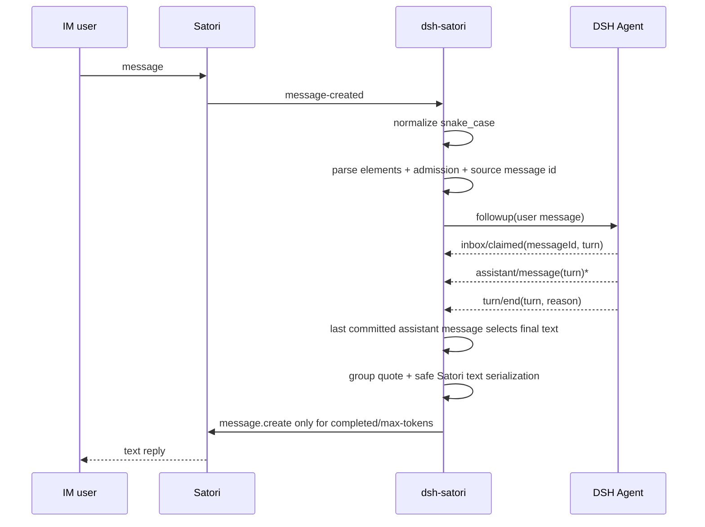

# dsh-satori

[中文](README-zh.md) | [English](README.md)

`dsh-satori` is a lightweight bridge between DeepSeek Harness and Satori. Satori owns access to IM platforms such as Telegram, Discord, and Lark; the plugin owns admission, DSH session mapping, and reply correlation.

The current MVP handles text only and uses Satori's `/v1/events` WebSocket and `/v1/message.create` API directly.

## Architecture


See [`docs/architecture.md`](docs/architecture.md), [`docs/data-flow.md`](docs/data-flow.md), and [`docs/uml.md`](docs/uml.md) for the detailed design.

## Requirements

- DeepSeek Harness with an agent loop and session persistence configured.
- Node.js `^22.19.0 || >=24.0.0`.
- A running Satori Server with at least one IM adapter.

The current CI API-compatibility baseline is pinned to DeepSeek Harness `47f943859bef60e4160492346772ded9b24f765a` (repository version `0.1.0-rc.5`). The compatibility job builds DSH's public host declarations with DSH's own `build:lib:host` configuration and then strict-typechecks this plugin against them. This protects the compile-time integration boundary; a real DSH + Satori runtime round trip remains an explicit E2E gate before release.

## Build

```sh
git clone https://github.com/Ri0n72Y/dsh-satori.git
cd dsh-satori
pnpm install --frozen-lockfile
pnpm test
pnpm build
```

The build output is written to `lib/`.

## Install into DSH

Local directory:

```sh
dsh plugin --profile web add /absolute/path/to/dsh-satori
```

GitHub:

```sh
dsh plugin --profile web add github:Ri0n72Y/dsh-satori
```

Git installs compile TypeScript through `prepare`. If pnpm blocks the build script, add this to `$DSH_HOME/profiles/web/pnpm-workspace.yaml`:

```yaml
allowBuilds:
  dsh-satori: true
```

Then inspect the composed config and start DSH:

```sh
dsh --profile web --dump-config
dsh --profile web
```

## Configure Satori

```sh
SATORI_BASE_URL=http://127.0.0.1:5140/satori
SATORI_TOKEN=your-token
```

Omit `SATORI_TOKEN` when the Satori Server does not require authentication.

### DSH workspace

The plugin does not invent a working directory when none is configured. If `SATORI_CWD` is unset, fresh DSH sessions omit `meta.cwd` and preserve DSH's own default semantics.

Set an explicit workspace when IM sessions should be pinned to one directory:

```sh
SATORI_CWD=/absolute/path/to/safe-workspace
```

The configured value is trimmed and resolved to an absolute path before it is written to fresh session metadata. For agents that can call filesystem, shell, or other tools, point this at a deliberate controlled workspace and verify the DSH profile's tool and approval policy as well.

### Admission

External senders are denied by default. Allow at least a user or a channel:

```sh
SATORI_ALLOWED_USERS=telegram:123456
SATORI_ALLOWED_CHANNELS=discord:987654321
```

Separate multiple values with commas. IDs may contain `:`, for example:

```sh
SATORI_ALLOWED_USERS=matrix:@alice:example.org
```

Already URI-encoded IDs are normalized before comparison as well.

You may also restrict which Satori login can drive DSH:

```sh
SATORI_ALLOWED_LOGINS=telegram:my_bot_id
```

For trusted test environments only:

```sh
SATORI_UNSAFE_ALLOW_ALL=1
```

Self messages are rejected primarily by comparing the sender ID with Satori `event.selfId`; `login.user.id` and `user.isBot` provide additional guards.

Allowing a group channel admits senders in that channel, while each sender still maps to a distinct DSH session. For Satori `Channel.Type.TEXT` channels, the plugin requires the event's source `message.id` and quotes that message in the outbound reply. A text-channel event without a source message ID is ignored so concurrent replies cannot lose their origin.

## Text messages

Satori carries `message.content` on the wire as serialized elements. The plugin parses it with Satori's official `@satorijs/element` parser and passes only text nodes to DSH. Images, mentions, quotes, and other non-text elements are not sent to the model in the MVP. Messages without text are ignored.

Plain DSH replies are serialized through the same Satori element library. Model output such as `<at/>` or `` therefore remains visible text instead of being interpreted as Satori message elements. Group replies prepend a standard `<quote id="..."/>` transport element before the safely escaped model text; the quote comes from source-message metadata and is not part of model context.

## Session mapping

Each Satori login, channel, and sender maps to a stable DSH session. The SessionId is derived from the raw identity fields with SHA-256 and keeps only a short readable platform label:

```text
<bounded-prefix>:<bounded-platform>:<identity-hash>
```

This bounds the session id and avoids writing complete external user/channel IDs into persistence directory names.

The plugin owns at most 32 live agents by default. Agent resolution/creation and the synchronous `followup()` are kept in one capacity critical section. Capacity eviction only disposes idle agents, with agents older than `idleTtlMs` preferred on the next capacity check.

## Message path



Only the DSH turn correlated to the original Satori input can be forwarded. Every `assistant/message` replaces that turn's final candidate state; if the last committed assistant message has no visible text, earlier text is not reused as the final reply. `error`, `aborted`, `blocked`, and `interrupted` turns send no reply. `max-tokens` sends the final committed visible text when one exists.

## Reconnect and delivery semantics

The plugin keeps the last **received** Satori event sequence and sends it as `sn` on the next IDENTIFY. A connection resets its retry counter only after `READY`. Ordinary disconnects use exponential backoff. A Satori `4004 invalid token` close stops automatic reconnect and records the reason until configuration is fixed or the plugin is reloaded.

`sn` is a transport receive cursor, not an acknowledgement that DSH successfully processed the event. Inbound and outbound delivery are currently at-most-once oriented: entering a local event handler does not roll back `sn` after a later business failure, and a failed `message.create` is logged rather than blindly retried without an idempotency key. Whether a Satori Server can replay missed events from `sn` depends on the deployed Server version and its available resume buffer, so the real E2E must verify it.

## Lifecycle

On plugin unload, new message admission closes first and `SessionRouter.dispose()` starts immediately. The router aborts cancellable session-persistence lookups while the Satori client drains inbound/outbound work. Work already inside non-cancellable DSH `agents.create/resume` is handled by the existing ownership checks when it returns.

## Development

Read [`AGENTS.md`](AGENTS.md) before editing. Changes to components, dependencies, message flow, session identity, lifecycle, authentication, reconnect behavior, or ownership must update the relevant Mermaid diagram in the same PR.

```sh
pnpm test
pnpm build
```

CI also checks out the pinned DSH source baseline independently, builds its host declarations, and runs the plugin compatibility typecheck.

## License

MIT
