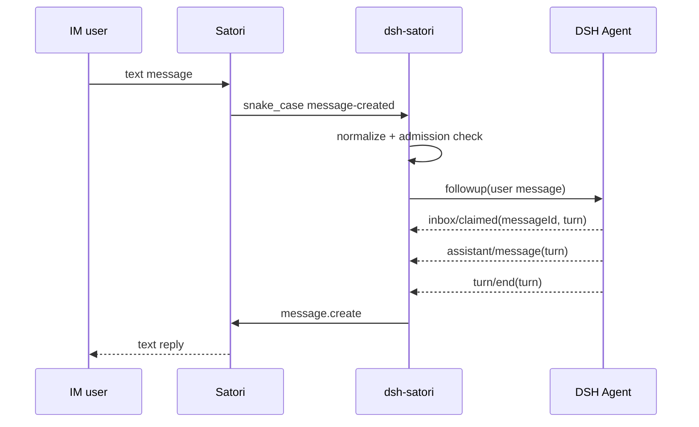

# dsh-satori

[中文](README-zh.md) | [English](README.md)

`dsh-satori` is a lightweight plugin connecting DeepSeek Harness and Satori. Satori handles IM platforms such as Telegram, Discord, and Lark. The plugin admits configured senders, maps their messages to DSH sessions, and sends the final reply from the correlated DSH turn back to the original conversation.

The current MVP handles text messages only. It uses Satori's `/v1/events` WebSocket and `/v1/message.create` API directly and does not reimplement platform protocols inside the plugin.

## Architecture


See [`docs/architecture.md`](docs/architecture.md), [`docs/data-flow.md`](docs/data-flow.md), and [`docs/uml.md`](docs/uml.md) for the maintained design diagrams. These Mermaid diagrams must be updated together with the code.

## Requirements

- DeepSeek Harness with an agent loop and session persistence configured.
- Node.js 22.19 or newer, matching the current DSH runtime requirement.
- A running Satori Server with at least one IM adapter configured.

Default Satori address:

```text
http://127.0.0.1:5140/satori
```

## Build

```sh
git clone https://github.com/Ri0n72Y/dsh-satori.git
cd dsh-satori
pnpm install
pnpm test
pnpm build
```

Build output is written to `lib/`.

## Install into DSH

### Install from a local directory

```sh
dsh plugin --profile web add /absolute/path/to/dsh-satori
```

### Install from GitHub

```sh
dsh plugin --profile web add github:Ri0n72Y/dsh-satori
```

Git installs use `prepare` to compile TypeScript. If pnpm blocks the build script, add this to `$DSH_HOME/profiles/web/pnpm-workspace.yaml`:

```yaml
allowBuilds:
  dsh-satori: true
```

To pin a version, install a specific commit:

```sh
dsh plugin --profile web add github:Ri0n72Y/dsh-satori#<commit-sha>
```

After installation, inspect the composed configuration and start DSH:

```sh
dsh --profile web --dump-config
dsh --profile web
```

## Configure Satori

Basic connection:

```sh
SATORI_BASE_URL=http://127.0.0.1:5140/satori
SATORI_TOKEN=your-token
```

`SATORI_TOKEN` can be omitted when the Satori Server does not require authentication.

### Admission control

The plugin denies external senders by default. Configure at least one allowed user or channel:

```sh
SATORI_ALLOWED_USERS=telegram:123456
```

or:

```sh
SATORI_ALLOWED_CHANNELS=discord:987654321
```

Separate multiple values with commas:

```sh
SATORI_ALLOWED_USERS=telegram:123456,lark:ou_xxx
```

You can also restrict which Satori bot login may drive DSH:

```sh
SATORI_ALLOWED_LOGINS=telegram:my_bot_id
```

These values use `<platform>:<id>`. The platform and ID parts are URI-encoded independently inside the plugin.

For trusted testing only, admission checks can be disabled temporarily:

```sh
SATORI_UNSAFE_ALLOW_ALL=1
```

Messages from the bot itself and senders marked as bots by Satori are still ignored.

The same options can be configured directly in the profile:

```yaml
- id: satori
  name: dsh-satori
  config:
    baseUrl: http://127.0.0.1:5140/satori
    token: your-token
    allowedUsers:
      - telegram:123456
    allowedChannels: []
    allowedLogins: []
    sessionPrefix: satori
    maxLiveAgents: 32
    idleTtlMs: 900000
```

`provider` and `model` are optional. When unset, the plugin uses the model route supplied by the current DSH composition.

## Session mapping

The MVP creates an isolated session for each sender in each channel:

```text
<sessionPrefix>:<platform>:<selfId>:<channelId>:<userId>
```

Different users in the same group therefore do not share DSH history. On an incoming message, the plugin first checks for a live Agent. If none exists, it checks session persistence, resumes an existing session, or creates a new one.

The plugin owns at most 32 live Agents by default. At capacity it releases the oldest idle Agent first; idle Agents older than `idleTtlMs` are reclaimed during capacity checks. Persisted sessions can be resumed later.

## Message path



A reply is sent only for the DSH turn correlated with the originating Satori message. Output produced by another driver of the same session is not forwarded to IM.

## Protocol compatibility

The plugin targets the Satori v1 HTTP/WebSocket surface. The current Satori Server sends snake_case wire fields; `SatoriClient` normalizes them to camelCase before business logic sees the event.

## Development

Read [`AGENTS.md`](AGENTS.md) before making changes. If code changes component relationships, dependencies, message flow, session identity, lifecycle, authentication, admission, retry behavior, or ownership, update the matching Mermaid diagram in the same PR.

```sh
pnpm test
pnpm build
```

## License

MIT
