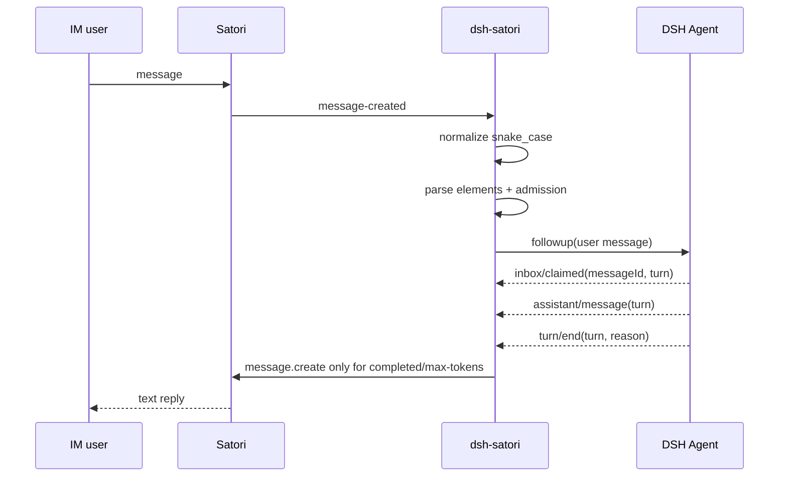

# dsh-satori

[中文](README-zh.md) | [English](README.md)

`dsh-satori` is a lightweight bridge between DeepSeek Harness and Satori. Satori owns access to IM platforms such as Telegram, Discord, and Lark; the plugin owns admission, DSH session mapping, and reply correlation.

The current MVP handles text only and uses Satori's `/v1/events` WebSocket and `/v1/message.create` API directly.

## Architecture


See [`docs/architecture.md`](docs/architecture.md), [`docs/data-flow.md`](docs/data-flow.md), and [`docs/uml.md`](docs/uml.md) for the detailed design.

## Requirements

- DeepSeek Harness with an agent loop and session persistence configured.
- Node.js 22.19 or later.
- A running Satori Server with at least one IM adapter.

## Build

```sh
git clone https://github.com/Ri0n72Y/dsh-satori.git
cd dsh-satori
pnpm install --frozen-lockfile
pnpm test
pnpm build
```

The build output is written to `lib/`.

## Install into DSH

Local directory:

```sh
dsh plugin --profile web add /absolute/path/to/dsh-satori
```

GitHub:

```sh
dsh plugin --profile web add github:Ri0n72Y/dsh-satori
```

Git installs compile TypeScript through `prepare`. If pnpm blocks the build script, add this to `$DSH_HOME/profiles/web/pnpm-workspace.yaml`:

```yaml
allowBuilds:
  dsh-satori: true
```

Then inspect the composed config and start DSH:

```sh
dsh --profile web --dump-config
dsh --profile web
```

## Configure Satori

```sh
SATORI_BASE_URL=http://127.0.0.1:5140/satori
SATORI_TOKEN=your-token
```

Omit `SATORI_TOKEN` when the Satori Server does not require authentication.

### Admission

External senders are denied by default. Allow at least a user or a channel:

```sh
SATORI_ALLOWED_USERS=telegram:123456
SATORI_ALLOWED_CHANNELS=discord:987654321
```

Separate multiple values with commas. IDs may contain `:`, for example:

```sh
SATORI_ALLOWED_USERS=matrix:@alice:example.org
```

Already URI-encoded IDs are normalized before comparison as well.

You may also restrict which Satori login can drive DSH:

```sh
SATORI_ALLOWED_LOGINS=telegram:my_bot_id
```

For trusted test environments only:

```sh
SATORI_UNSAFE_ALLOW_ALL=1
```

Self messages and senders marked as bots by Satori are still ignored.

## Text messages

Satori carries `message.content` on the wire as serialized elements. The plugin parses it with Satori's official `@satorijs/element` parser and passes only text nodes to DSH. Images, mentions, quotes, and other non-text elements are not sent to the model in the MVP. Messages without text are ignored.

## Session mapping

Each Satori login, channel, and sender maps to a stable DSH session. The SessionId is derived from the raw identity fields with SHA-256 and keeps only a short readable platform label:

```text
<bounded-prefix>:<bounded-platform>:<identity-hash>
```

This bounds the session id and avoids writing complete external user/channel IDs into persistence directory names.

The plugin owns at most 32 live agents by default. Agent resolution/creation and the synchronous `followup()` are kept in one capacity critical section. Capacity eviction only disposes idle agents, with agents older than `idleTtlMs` preferred on the next capacity check.

## Message path



Only the DSH turn correlated to the original Satori input can be forwarded. `error`, `aborted`, `blocked`, and `interrupted` turns do not leak an earlier assistant message as a final reply. `max-tokens` sends the committed text that exists.

## Reconnect

The plugin keeps the last received Satori event sequence and sends it as `sn` on the next IDENTIFY. A connection resets its retry counter only after `READY`. Ordinary disconnects use exponential backoff. A Satori `4004 invalid token` close stops automatic reconnect and records the reason until configuration is fixed or the plugin is reloaded.

## Development

Read [`AGENTS.md`](AGENTS.md) before editing. Changes to components, dependencies, message flow, session identity, lifecycle, authentication, reconnect behavior, or ownership must update the relevant Mermaid diagram in the same PR.

```sh
pnpm test
pnpm build
```

## License

MIT
