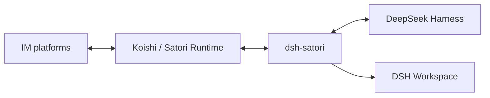

# dsh-satori

[中文](README-zh.md) | [English](README.md)

`dsh-satori` is a small bridge between DeepSeek Harness and Satori. It receives Satori messages, applies admission and session mapping, sends text to a DSH Agent, and returns the settled reply to the source channel.

The current MVP handles text only.

## Architecture



Platform accounts, tokens, app IDs, and secrets belong in the Koishi / Satori Runtime. They are not configured in DSH or `dsh-satori`. Prepare a runtime with the required platform adapter and Satori Server before connecting this plugin.

- [Koishi installation](https://koishi.chat/en-US/manual/starter/)
- [Satori SDK and adapters](https://satori.chat/en-US/sdk/)
- [`server-satori` configuration](https://koishi.chat/en-US/plugins/develop/server-satori)

See [`docs/architecture.md`](docs/architecture.md), [`docs/data-flow.md`](docs/data-flow.md), and [`docs/uml.md`](docs/uml.md) for the detailed design.

## Requirements

- DeepSeek Harness with agent loop and session persistence configured.
- Node.js `^22.19.0 || >=24.0.0`.
- A configured Koishi / Satori Runtime with at least one working IM adapter.

The source compatibility baseline is pinned to DeepSeek Harness `47f943859bef60e4160492346772ded9b24f765a`, repository version `0.1.0-rc.5`. Published DSH peers used by this plugin start at `0.1.0-rc.6`.

## Install into DSH

GitHub:

```sh
dsh plugin --profile web add github:Ri0n72Y/dsh-satori
```

Local checkout:

```sh
dsh plugin --profile web add /absolute/path/to/dsh-satori
```

Git installs compile TypeScript through `prepare`. If pnpm blocks the build script, add this to `$DSH_HOME/profiles/web/pnpm-workspace.yaml`:

```yaml
allowBuilds:
  dsh-satori: true
```

Then inspect the composed config and start DSH:

```sh
dsh --profile web --dump-config
dsh --profile web
```

## Configuration

```sh
SATORI_BASE_URL=http://127.0.0.1:5140/satori
SATORI_TOKEN=your-token
SATORI_CWD=/absolute/path/to/safe-workspace
SATORI_ALLOWED_USERS=telegram:123456
SATORI_ALLOWED_CHANNELS=discord:987654321
SATORI_ALLOWED_LOGINS=telegram:my_bot_id
```

`SATORI_TOKEN` and `SATORI_CWD` are optional.

The Web profile adds a `dsh-satori` card under `Settings > Plugins > Configurable`. Its `Workspace directory` field controls the working directory for Satori sessions and overrides `SATORI_CWD`. An existing DSH Workspace for that directory is reused; otherwise the existing directory is registered as a new Workspace. Clearing the field disables workspace binding.

Changing Workspace derives a new SessionId for the same Satori sender, which prevents a DSH conversation from being resumed across projects. The plugin uses DSH's canonical workspace path and calls `attachSession()` after session creation so the conversation appears with the other sessions in that Workspace.

External senders are denied by default. Configure at least `SATORI_ALLOWED_USERS` or `SATORI_ALLOWED_CHANNELS`. Separate multiple values with commas. IDs may contain `:`. Use this only in a trusted test environment:

```sh
SATORI_UNSAFE_ALLOW_ALL=1
```

## Behavior

- Inbound `message.content` is parsed with the official `@satorijs/element` package. Only text nodes enter model context; images, mentions, quotes, and other elements are ignored by the MVP.
- Outbound text is serialized through the same element library, so model output such as `<at/>` or `` remains plain text.
- Group senders map to separate DSH sessions and replies use the source `message.id` as a standard Satori quote. Direct messages do not add a quote.
- Only `completed` or `max-tokens` turns correlated to the originating Satori input can produce a reply. If the last committed assistant message has no visible text, earlier text is not reused.
- `sn` is a receive cursor. Inbound and outbound delivery are currently at-most-once oriented; replay depends on the deployed Satori Server.

Session IDs are derived from the Satori identity fields and current Workspace path with SHA-256, so full external IDs and directory paths are not written into persistence directory names. The plugin owns at most 32 live agents by default and only evicts idle agents.

## Development and verification

```sh
pnpm install --frozen-lockfile
pnpm test
pnpm build
pnpm pack
```

Current verification:

- Vitest: 47/47 tests passed across 8 files.
- Host ESM and the Web client bundle both build and pack successfully.
- Strict typecheck passed against the pinned DSH `0.1.0-rc.5` source declarations, including Workspace, Settings, and WebServer APIs.
- Satori wire runtime E2E passed 13/13 checks. That test predates the Workspace panel feature and uses DSH stubs.
- A full E2E with the real DSH Web settings card, WorkspaceRegistry, Agent Loop, a model, and a real Satori Server is still pending.

Development rules are in [`AGENTS.md`](AGENTS.md).

## License

MIT
