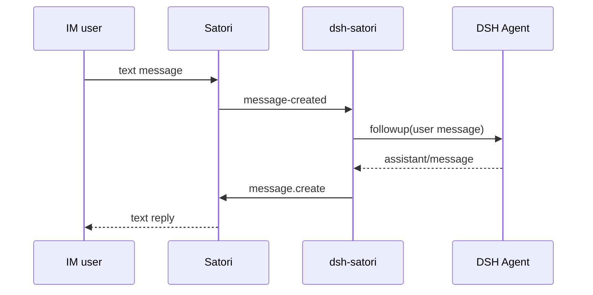

# dsh-satori

[中文](README-zh.md) | [English](README.md)

`dsh-satori` is a lightweight plugin connecting DeepSeek Harness and Satori. Satori handles access to IM platforms such as Telegram, Discord, and Lark. The plugin maps Satori conversations to DSH sessions and sends DSH replies back to the original conversation.

The current MVP handles text messages only. The same Satori login identity and channel map to a stable DSH session, so the conversation can continue after the plugin reconnects.

## Architecture


See [`docs/architecture.md`](docs/architecture.md), [`docs/data-flow.md`](docs/data-flow.md), and [`docs/uml.md`](docs/uml.md) for the maintained design diagrams. These Mermaid diagrams must be updated together with the code.

## Requirements

- DeepSeek Harness with an agent loop and session persistence configured.
- Node.js 22.19 or newer, matching the current DSH runtime requirement.
- A running Satori Server with at least one IM adapter configured.

Default Satori address:

```text
http://127.0.0.1:5140/satori
```

## Build

```sh
git clone https://github.com/Ri0n72Y/dsh-satori.git
cd dsh-satori
pnpm install
pnpm test
pnpm build
```

Build output is written to `lib/`.

## Install into DSH

### Install from a local directory

```sh
dsh plugin --profile web add /absolute/path/to/dsh-satori
```

After installation, inspect the composed configuration before starting DSH:

```sh
dsh --profile web --dump-config
dsh --profile web
```

### Install from GitHub

```sh
dsh plugin --profile web add github:Ri0n72Y/dsh-satori
```

Git installs use `prepare` to compile TypeScript. pnpm may require explicit permission before running dependency build scripts. If the first install is blocked, add this to `$DSH_HOME/profiles/web/pnpm-workspace.yaml`:

```yaml
allowBuilds:
  dsh-satori: true
```

Then run the install command again.

To pin a reproducible version, install a specific commit:

```sh
dsh plugin --profile web add github:Ri0n72Y/dsh-satori#<commit-sha>
```

## Configure Satori

The bundled Cordis patch reads these environment variables:

```sh
SATORI_BASE_URL=http://127.0.0.1:5140/satori
SATORI_TOKEN=your-token
```

`SATORI_TOKEN` can be omitted when the Satori Server does not require authentication.

You can also edit the plugin row in the profile's `cordis.patch.yml`:

```yaml
- id: satori
  name: dsh-satori
  config:
    baseUrl: http://127.0.0.1:5140/satori
    token: your-token
    sessionPrefix: satori
```

`provider` and `model` are optional. When left unset, the plugin uses the model route supplied by the current DSH composition.

## Session mapping

A Satori conversation maps to:

```text
<sessionPrefix>:<platform>:<selfId>:<channelId>
```

When a message arrives, the plugin first looks for a live Agent with the same ID. If none exists, it tries to resume the persisted session. If the session cannot be resumed, it creates a new one.

## Current message path



## Development

Read [`AGENTS.md`](AGENTS.md) before making changes. If code changes component relationships, dependencies, message flow, session identity, lifecycle, authentication, retry behavior, or ownership, update the matching Mermaid diagram in the same PR.

```sh
pnpm test
pnpm build
```

## License

MIT
