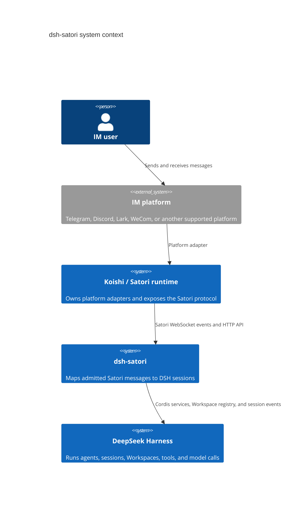
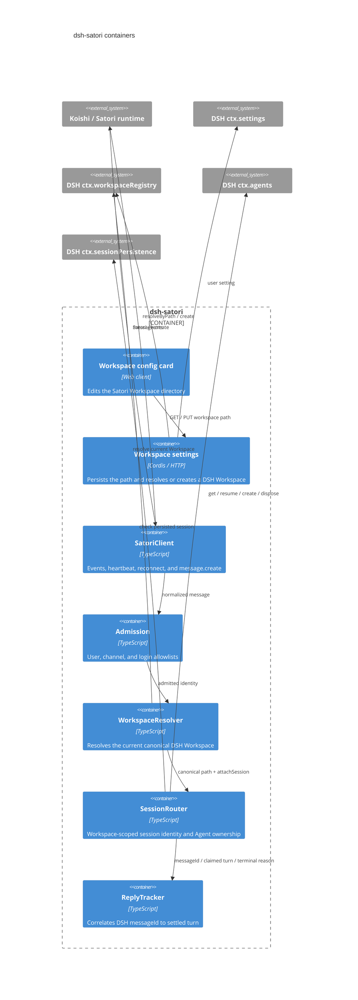

# Architecture

## C4 context

```mermaid
C4Context
    title dsh-satori system context

    Person(user, "IM user")
    System_Ext(platform, "IM platform", "Telegram, Discord, Lark, WeCom, or another supported platform")
    System(satori, "Koishi / Satori runtime", "Owns platform adapters and exposes the Satori protocol")
    System(dshSatori, "dsh-satori", "Maps admitted Satori messages to DSH sessions")
    System(dsh, "DeepSeek Harness", "Runs agents, sessions, Workspaces, tools, and model calls")

    Rel(user, platform, "Sends and receives messages")
    Rel(platform, satori, "Platform adapter")
    Rel(satori, dshSatori, "Satori WebSocket events and HTTP API")
    Rel(dshSatori, dsh, "Cordis services, Workspace registry, and session events")
```

## C4 container view

```mermaid
C4Container
    title dsh-satori containers

    Container_Boundary(plugin, "dsh-satori") {
        Container(configCard, "Workspace config card", "Web client", "Edits the Satori Workspace directory")
        Container(configHost, "Workspace settings", "Cordis / HTTP", "Persists the path and resolves or creates a DSH Workspace")
        Container(client, "SatoriClient", "TypeScript", "Events, heartbeat, reconnect, and message.create")
        Container(admission, "Admission", "TypeScript", "User, channel, and login allowlists")
        Container(workspace, "WorkspaceResolver", "TypeScript", "Resolves the current canonical DSH Workspace")
        Container(router, "SessionRouter", "TypeScript", "Workspace-scoped session identity and Agent ownership")
        Container(tracker, "ReplyTracker", "TypeScript", "Correlates DSH messageId to settled turn")
    }

    System_Ext(satori, "Koishi / Satori runtime")
    System_Ext(settings, "DSH ctx.settings")
    System_Ext(workspaces, "DSH ctx.workspaceRegistry")
    System_Ext(agents, "DSH ctx.agents")
    System_Ext(persistence, "DSH ctx.sessionPersistence")

    Rel(configCard, configHost, "GET / PUT workspace path")
    Rel(configHost, settings, "user setting")
    Rel(configHost, workspaces, "resolveByPath / create")
    Rel(satori, client, "Satori events")
    Rel(client, satori, "message.create")
    Rel(client, admission, "normalized message")
    Rel(admission, workspace, "admitted identity")
    Rel(workspace, workspaces, "resolve current Workspace")
    Rel(workspace, router, "canonical path + attachSession")
    Rel(router, agents, "get / resume / create / dispose")
    Rel(router, persistence, "check persisted session")
    Rel(router, tracker, "messageId / claimed turn / terminal reason")
```
