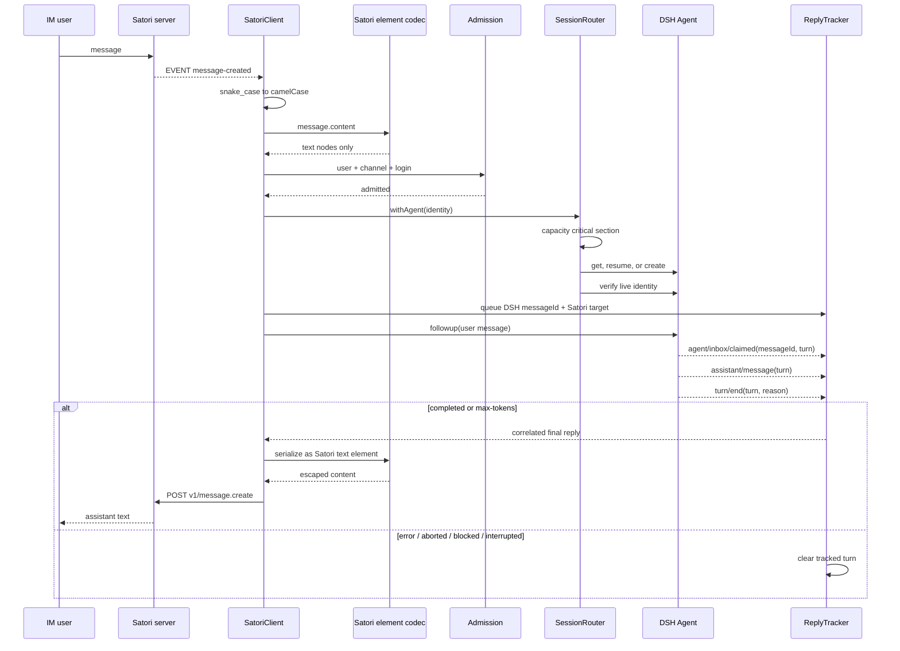

# Data flow

```mermaid
sequenceDiagram
    participant U as IM user
    participant S as Satori server
    participant C as SatoriClient
    participant E as Satori element codec
    participant G as Admission
    participant R as SessionRouter
    participant A as DSH Agent
    participant T as ReplyTracker

    U->>S: message
    S-->>C: EVENT message-created
    C->>C: snake_case to camelCase
    C->>E: message.content
    E-->>C: text nodes only
    C->>G: user + channel + login
    G-->>C: admitted
    C->>R: withAgent(identity)
    R->>R: capacity critical section
    R->>A: get, resume, or create
    R->>A: verify live identity
    C->>T: queue DSH messageId + Satori target
    C->>A: followup(user message)
    A-->>T: agent/inbox/claimed(messageId, turn)
    A-->>T: assistant/message(turn)
    A-->>T: turn/end(turn, reason)
    alt completed or max-tokens
        T-->>C: correlated final reply
        C->>E: serialize as Satori text element
        E-->>C: escaped content
        C->>S: POST v1/message.create
        S-->>U: assistant text
    else error / aborted / blocked / interrupted
        T->>T: clear tracked turn
    end
```

Session identity uses a bounded deterministic hash of `platform + selfId + channelId + userId`. The raw identity remains in runtime routing data rather than the DSH SessionId.
