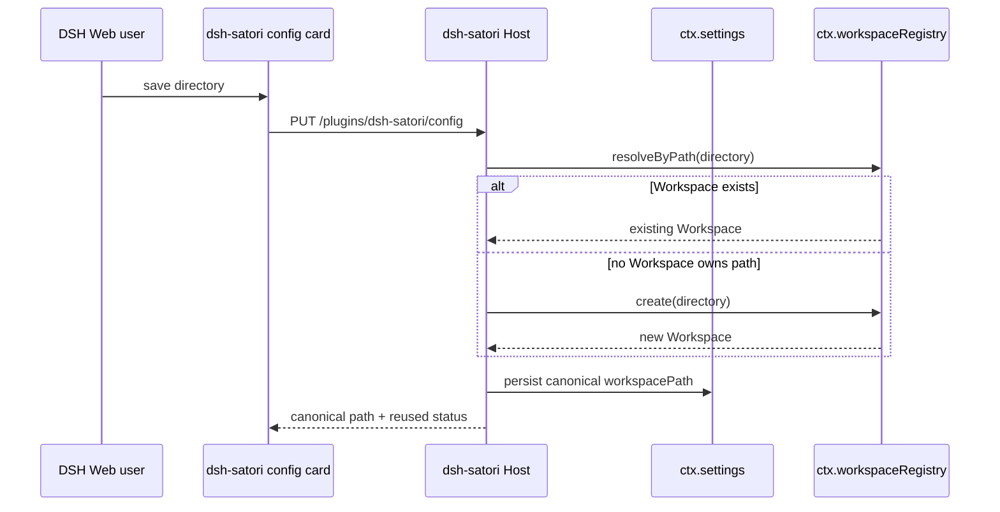
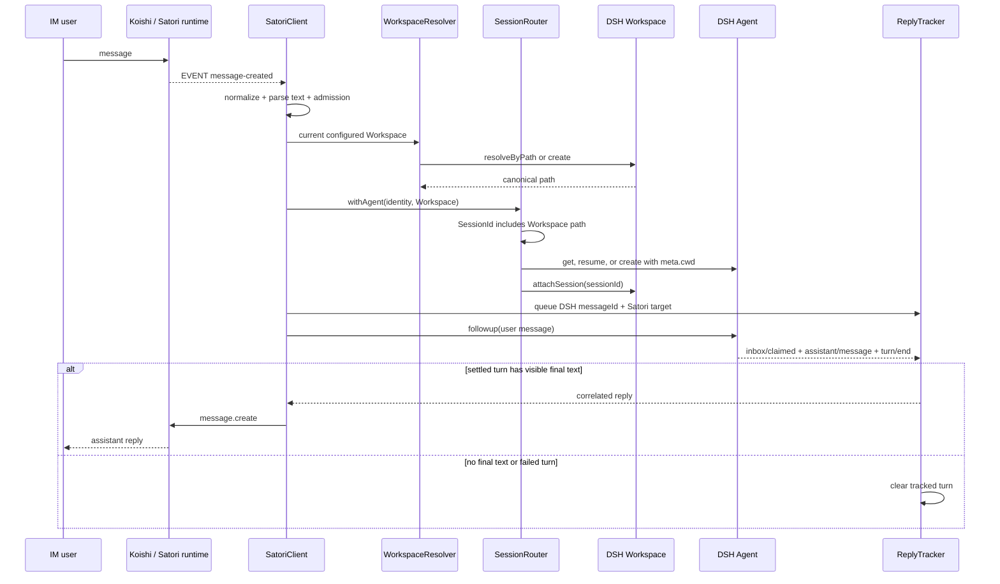

# Data flow

## Workspace configuration

The directory must already exist. DSH owns canonicalization and Workspace records; the plugin does not create filesystem directories.

## Message path

Changing the configured Workspace changes the SessionId discriminator. Existing sessions remain attached to their original Workspace instead of crossing project directories.

During teardown, the router aborts cancellable persistence work before draining owned agents. Satori `sn` advances when an event is received, so it is a transport cursor rather than an end-to-end processing acknowledgement.
