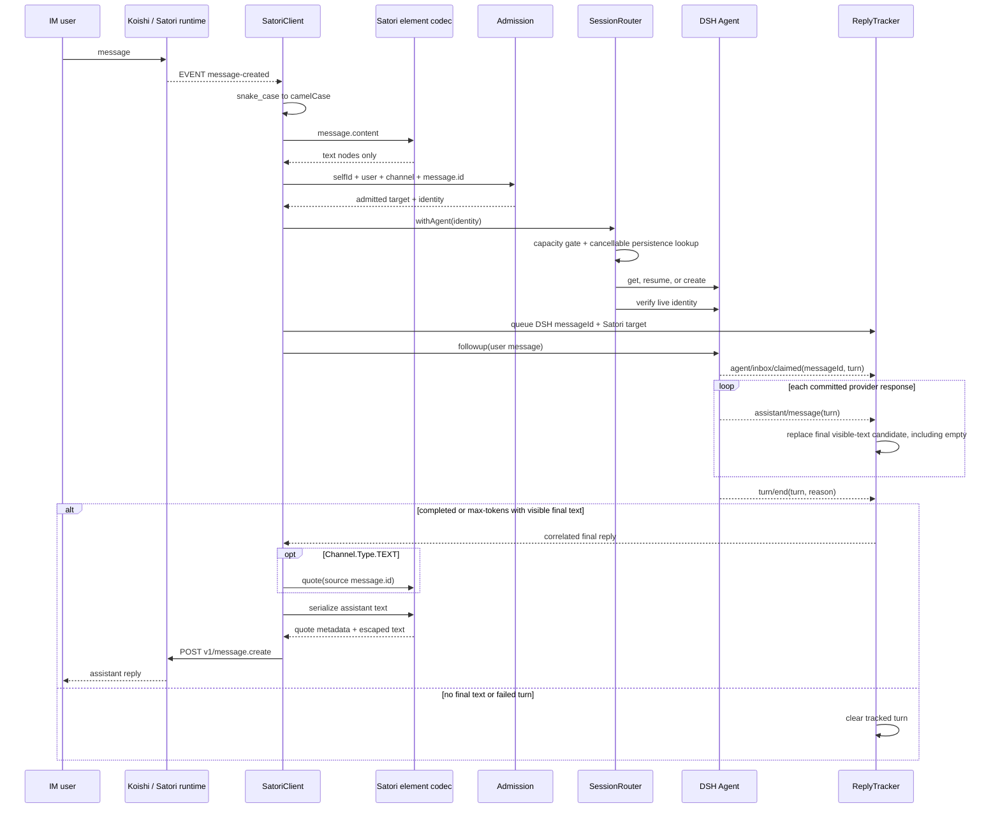

# Data flow

Session identity is a bounded hash of `platform + selfId + channelId + userId`. Group replies require a source `message.id`; direct replies do not add a quote.

During teardown, the router aborts cancellable persistence work before draining owned agents. Satori `sn` advances when an event is received, so it is a transport cursor rather than an end-to-end processing acknowledgement.
