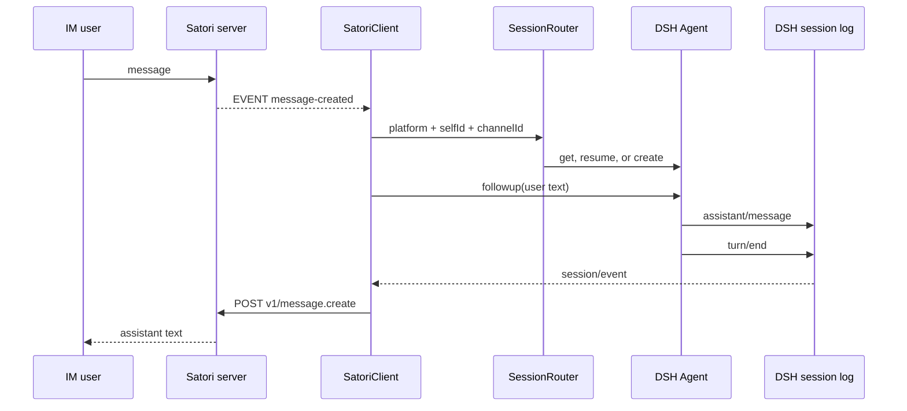

# Data flow

## Text message round trip



The session key is deterministic:

```text
<sessionPrefix>:<platform>:<selfId>:<channelId>
```

Each component is URI-encoded before joining. A direct chat and a group channel therefore keep separate DSH histories. Multiple users in the same group share the group session.
