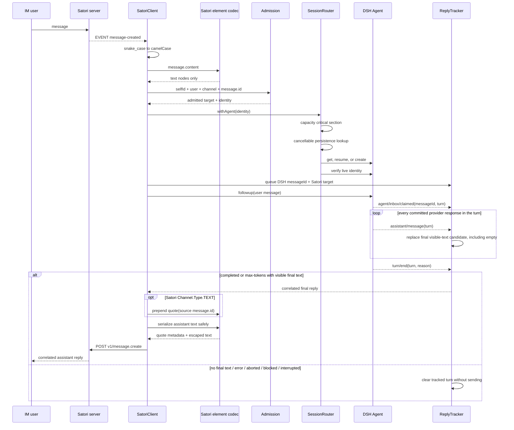

# Data flow

Session identity uses a bounded deterministic hash of `platform + selfId + channelId + userId`. The raw identity remains in runtime routing data rather than the DSH SessionId. A text/group channel requires a source `message.id` so concurrent replies can preserve their origin; direct channels do not add a quote.

On teardown, `SessionRouter.dispose()` marks the router closed and aborts cancellable `sessionPersistence.list(signal)` work before waiting for its capacity gate. Router disposal and `SatoriClient.stop()` then drain concurrently. Satori `sn` is advanced on receipt, so it is a transport cursor rather than an end-to-end processing acknowledgement.
