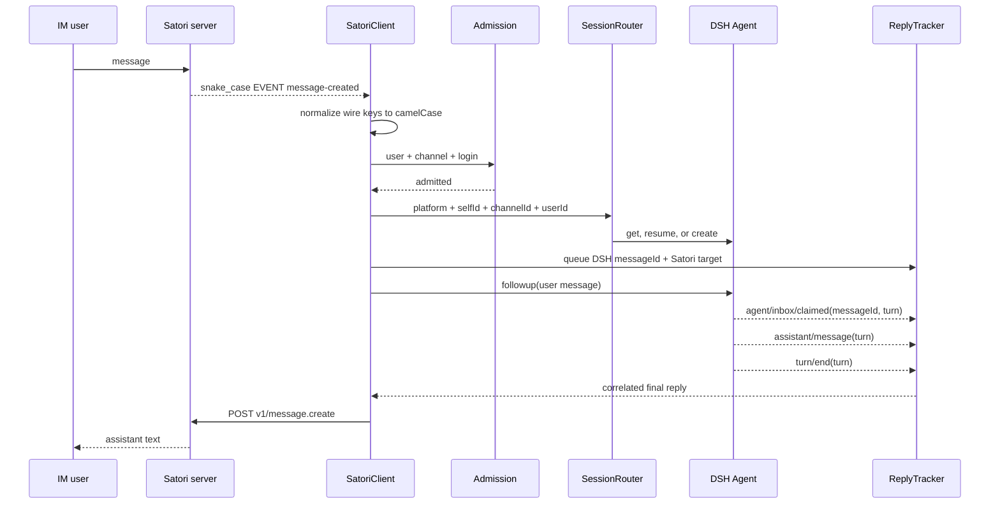

# Data flow

## Text message round trip



The session key is deterministic:

```text
<sessionPrefix>:<platform>:<selfId>:<channelId>:<userId>
```

Each component is URI-encoded before joining. Different senders in the same group channel therefore get separate DSH histories in the MVP.

The bridge sends a DSH reply to Satori only when the originating Satori message was claimed into that exact DSH turn. Output produced by another driver of the same session is ignored.
