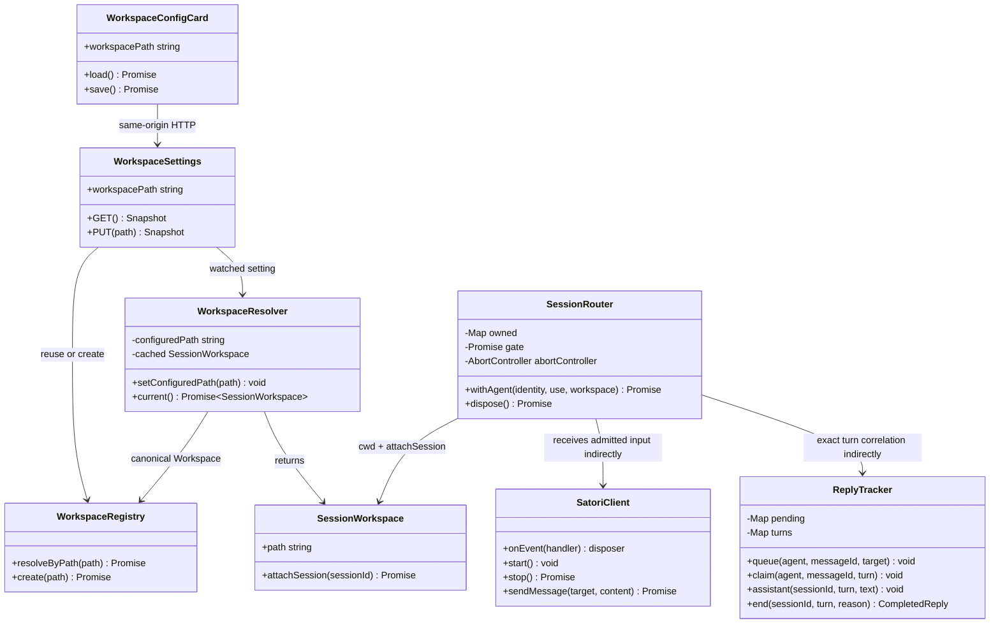

# Runtime model

```mermaid
classDiagram
    class WorkspaceConfigCard {
        +workspacePath string
        +load() Promise
        +save() Promise
    }

    class WorkspaceSettings {
        +workspacePath string
        +GET() Snapshot
        +PUT(path) Snapshot
    }

    class WorkspaceResolver {
        -configuredPath string
        -cached SessionWorkspace
        +setConfiguredPath(path) void
        +current() Promise~SessionWorkspace~
    }

    class SessionWorkspace {
        +path string
        +attachSession(sessionId) Promise
    }

    class SessionRouter {
        -Map owned
        -Promise gate
        -AbortController abortController
        +withAgent(identity, use, workspace) Promise
        +dispose() Promise
    }

    class SatoriClient {
        +onEvent(handler) disposer
        +start() void
        +stop() Promise
        +sendMessage(target, content) Promise
    }

    class ReplyTracker {
        -Map pending
        -Map turns
        +queue(agent, messageId, target) void
        +claim(agent, messageId, turn) void
        +assistant(sessionId, turn, text) void
        +end(sessionId, turn, reason) CompletedReply
    }

    class WorkspaceRegistry {
        +resolveByPath(path) Promise
        +create(path) Promise
    }

    WorkspaceConfigCard --> WorkspaceSettings : same-origin HTTP
    WorkspaceSettings --> WorkspaceRegistry : reuse or create
    WorkspaceSettings --> WorkspaceResolver : watched setting
    WorkspaceResolver --> WorkspaceRegistry : canonical Workspace
    WorkspaceResolver --> SessionWorkspace : returns
    SessionRouter --> SessionWorkspace : cwd + attachSession
    SessionRouter --> SatoriClient : receives admitted input indirectly
    SessionRouter --> ReplyTracker : exact turn correlation indirectly
```
