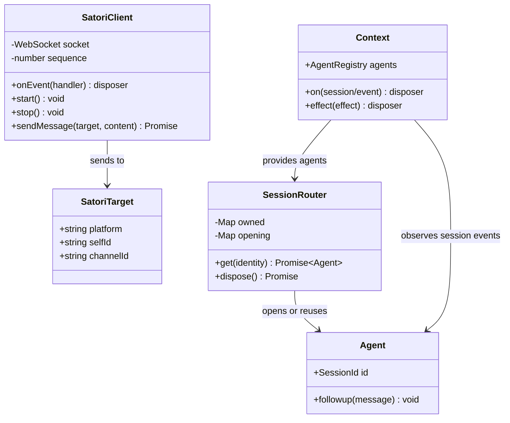

# Runtime model

```mermaid
classDiagram
    class SatoriClient {
        -WebSocket socket
        -number sequence
        +onEvent(handler) disposer
        +start() void
        +stop() void
        +sendMessage(target, content) Promise
    }

    class SessionRouter {
        -Map owned
        -Map opening
        +get(identity) Promise~Agent~
        +dispose() Promise
    }

    class SatoriTarget {
        +string platform
        +string selfId
        +string channelId
    }

    class Agent {
        +SessionId id
        +followup(message) void
    }

    class Context {
        +AgentRegistry agents
        +on(session/event) disposer
        +effect(effect) disposer
    }

    SatoriClient --> SatoriTarget : sends to
    SessionRouter --> Agent : opens or reuses
    Context --> SessionRouter : provides agents
    Context --> Agent : observes session events
```
