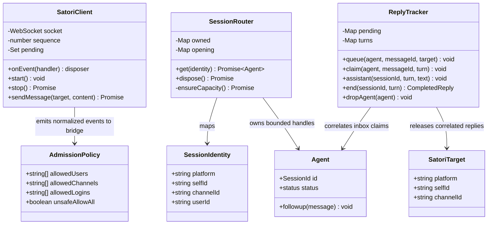

# Runtime model

```mermaid
classDiagram
    class SatoriClient {
        -WebSocket socket
        -number sequence
        -Set pending
        +onEvent(handler) disposer
        +start() void
        +stop() Promise
        +sendMessage(target, content) Promise
    }

    class SessionRouter {
        -Map owned
        -Map opening
        +get(identity) Promise~Agent~
        +dispose() Promise
        -ensureCapacity() Promise
    }

    class ReplyTracker {
        -Map pending
        -Map turns
        +queue(agent, messageId, target) void
        +claim(agent, messageId, turn) void
        +assistant(sessionId, turn, text) void
        +end(sessionId, turn) CompletedReply
        +dropAgent(agent) void
    }

    class AdmissionPolicy {
        +string[] allowedUsers
        +string[] allowedChannels
        +string[] allowedLogins
        +boolean unsafeAllowAll
    }

    class SatoriTarget {
        +string platform
        +string selfId
        +string channelId
    }

    class SessionIdentity {
        +string platform
        +string selfId
        +string channelId
        +string userId
    }

    class Agent {
        +SessionId id
        +followup(message) void
        +status status
    }

    SatoriClient --> AdmissionPolicy : emits normalized events to bridge
    SessionRouter --> SessionIdentity : maps
    SessionRouter --> Agent : owns bounded handles
    ReplyTracker --> SatoriTarget : releases correlated replies
    ReplyTracker --> Agent : correlates inbox claims
```
