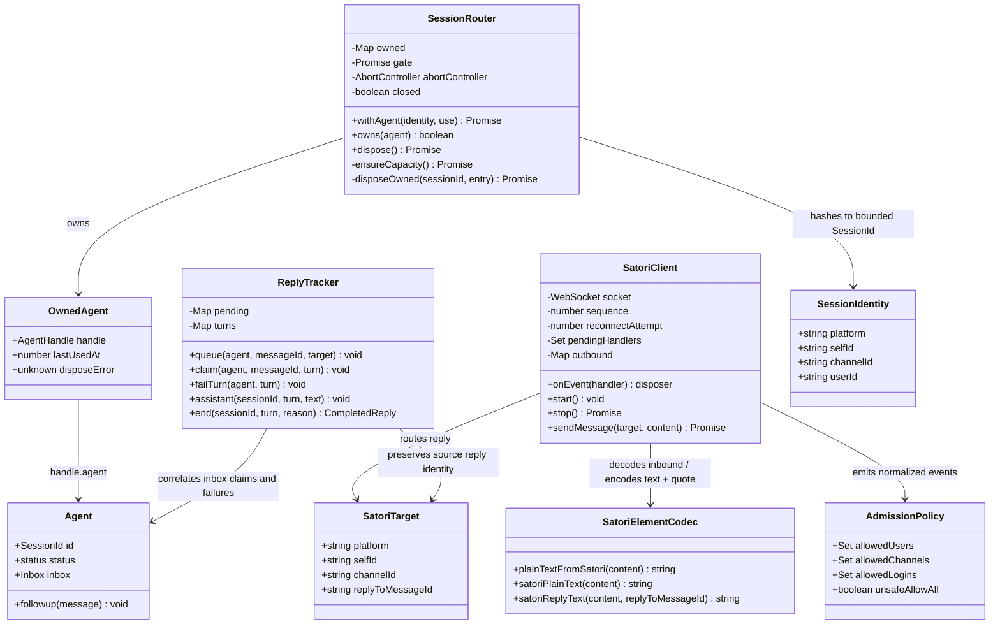

# Runtime model

```mermaid
classDiagram
    class SatoriClient {
        -WebSocket socket
        -number sequence
        -number reconnectAttempt
        -Set pendingHandlers
        -Map outbound
        +onEvent(handler) disposer
        +start() void
        +stop() Promise
        +sendMessage(target, content) Promise
    }

    class SatoriTarget {
        +string platform
        +string selfId
        +string channelId
        +string replyToMessageId
    }

    class SatoriElementCodec {
        +plainTextFromSatori(content) string
        +satoriPlainText(content) string
        +satoriReplyText(content, replyToMessageId) string
    }

    class SessionRouter {
        -Map owned
        -Promise gate
        -AbortController abortController
        -boolean closed
        +withAgent(identity, use) Promise
        +owns(agent) boolean
        +dispose() Promise
        -ensureCapacity() Promise
        -disposeOwned(sessionId, entry) Promise
    }

    class OwnedAgent {
        +AgentHandle handle
        +number lastUsedAt
        +unknown disposeError
    }

    class ReplyTracker {
        -Map pending
        -Map turns
        +queue(agent, messageId, target) void
        +claim(agent, messageId, turn) void
        +failTurn(agent, turn) void
        +assistant(sessionId, turn, text) void
        +end(sessionId, turn, reason) CompletedReply
    }

    class AdmissionPolicy {
        +Set allowedUsers
        +Set allowedChannels
        +Set allowedLogins
        +boolean unsafeAllowAll
    }

    class SessionIdentity {
        +string platform
        +string selfId
        +string channelId
        +string userId
    }

    class Agent {
        +SessionId id
        +followup(message) void
        +status status
        +Inbox inbox
    }

    SatoriClient --> SatoriTarget : routes reply
    SatoriClient --> SatoriElementCodec : decodes inbound / encodes text + quote
    SatoriClient --> AdmissionPolicy : emits normalized events
    SessionRouter --> SessionIdentity : hashes to bounded SessionId
    SessionRouter --> OwnedAgent : owns
    OwnedAgent --> Agent : handle.agent
    ReplyTracker --> SatoriTarget : preserves source reply identity
    ReplyTracker --> Agent : correlates inbox claims and failures
```
